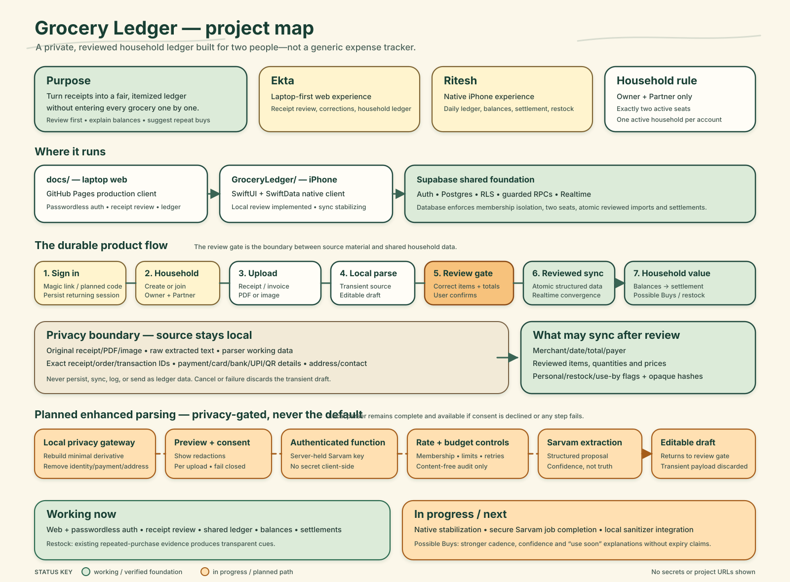

# Grocery Ledger project map

The [Grocery Ledger Evolution Map](grocery-ledger-evolution-map.svg) traces the
decision history: adopted architecture, receipt/AI/auth/UX evolution, resolved
alternatives, privacy gates, present state, and next milestones.

This map is the compact visual orientation for Grocery Ledger. It connects the
product purpose, strict two-person household, canonical clients, reviewed-data
flow, privacy boundary, hosted Supabase foundation, optional Sarvam path, current
delivery state, and Possible Buys direction.

## How to read it

- Green represents working capabilities or verified foundations.
- Cream represents the normal local-first product flow.
- Orange represents the human review gate and work that is planned or in progress.
- Solid arrows show the normal ledger path. Dashed arrows show the optional,
  consented enhanced-parsing path.

The core boundary is the review gate. Original receipts, PDFs or images and raw
extracted text remain local and transient. Exact receipt, order and transaction
identifiers; payment, card, bank, UPI and QR details; and customer address or
contact data are excluded from persistence and sync. Only reviewed structured
ledger fields may cross into the shared two-person household.

Sarvam is not the default parser. The planned path first rebuilds a minimal
redacted derivative locally, previews the redactions, obtains per-upload consent,
and then uses an authenticated server function with rate and budget controls. The
provider key never belongs in either client. Any sanitizer, consent, authorization
or provider failure returns to the complete local parser and editable review flow.

The map intentionally contains no backend project URL, credentials, API keys,
household codes, email addresses, receipt identifiers, or personal information
beyond the product users’ display names.

## Status vocabulary

“Working” means the capability exists in the current project flow; it does not
replace production acceptance evidence. “In progress” covers native stabilization
and the privacy-gated Sarvam job/sanitizer work. The established restock rule uses
repeated reviewed purchases; richer cadence, confidence and use-soon explanations
remain the Possible Buys enhancement direction.
